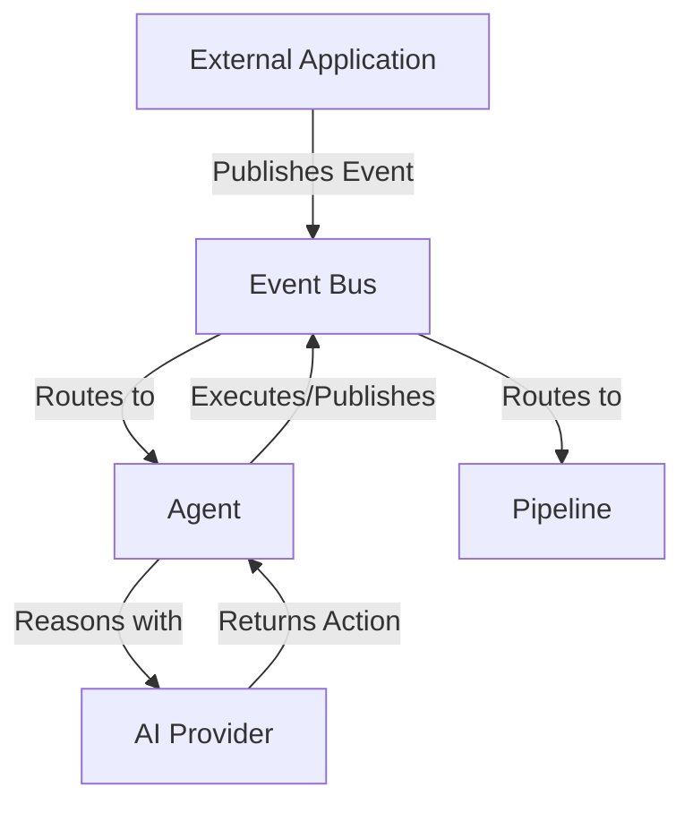

# AI Runtime for Event-Driven Business Applications


An Open-Source **AI Workflow Runtime** for generic business orchestration. Build autonomous agents, event pipelines, and AI workflows for any domain (Marketing, ERP, CRM, HRIS, Ticketing, Automation).

## 🚀 Why Agent Runtime?

Most AI frameworks focus on chatbots or agent conversations.

Agent Runtime focuses on event-driven business orchestration.

It is designed for building:
- ERP automation
- CRM automation
- HRIS workflows
- Marketing automation
- Internal business agents
- Multi-agent enterprise systems

Instead of centering everything around prompts,
Agent Runtime centers everything around events, workflows, and business processes.

### Features
✓ **Universal Event Bus**: Generic pub/sub for all business events.
✓ **AI Provider agnostic**: Native interfaces for OpenAI, Anthropic, Gemini, or Local LLMs.
✓ **Agent SDK**: Abstract classes to build autonomous workers.
✓ **Pipelines**: Compose modular event-processing steps.

## 🗺️ Roadmap

### v0.1
- In-Memory Event Bus
- Agent SDK
- Pipeline Engine

### v0.2
- Redis Event Bus
- Observability Hooks

### v0.3
- RabbitMQ Plugin
- Retry Policy
- Dead Letter Queue

### v0.4
- Workflow Runtime
- Workflow Graph Execution

### v0.5
- Workflow Persistence
- Human Approval Steps

### v1.0
- Stable Public API

## 📊 Project Status

Current Version: **v0.3.0 GA**

Status:
- Core Runtime Stable
- RabbitMQ Plugin Stable
- Workflow Runtime in Development (RFC Accepted)

The public API is considered stable for v0.3.x releases.

## 🏗️ Architecture



## 📦 Quick Start

```bash
npm install @agent-runtime/core
```

```typescript
import { Runtime, EventBus, Agent, Pipeline } from "@agent-runtime/core";

// 1. Initialize Runtime
const runtime = new Runtime();

// 2. Configure your preferred AI Provider
runtime.use(new AnthropicProvider(process.env.ANTHROPIC_API_KEY));

// 3. Register your custom autonomous agent
class LeadScoringAgent extends Agent {
  async onEvent(event) {
    if (event.type === 'lead.created') {
       const score = await this.ai.analyze(event.payload);
       this.bus.publish({ type: 'lead.scored', payload: { ...event.payload, score } });
    }
  }
}

runtime.register(new LeadScoringAgent());

// 4. Start processing
runtime.start();

// 5. Trigger an event
runtime.publish({ type: "lead.created", payload: { email: "test@example.com" } });
```

## 🤝 Contributing

We welcome contributions! Please see our [CONTRIBUTING.md](./CONTRIBUTING.md) for details.

## 📄 License

MIT License.
